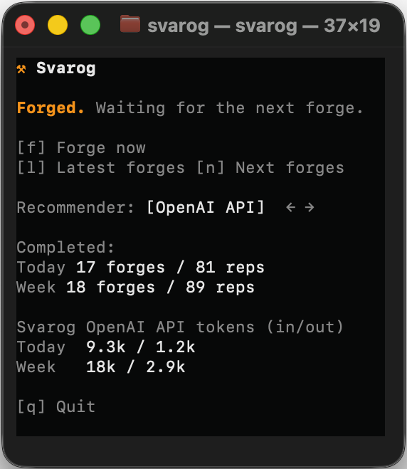
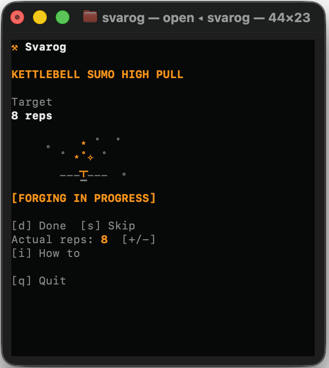
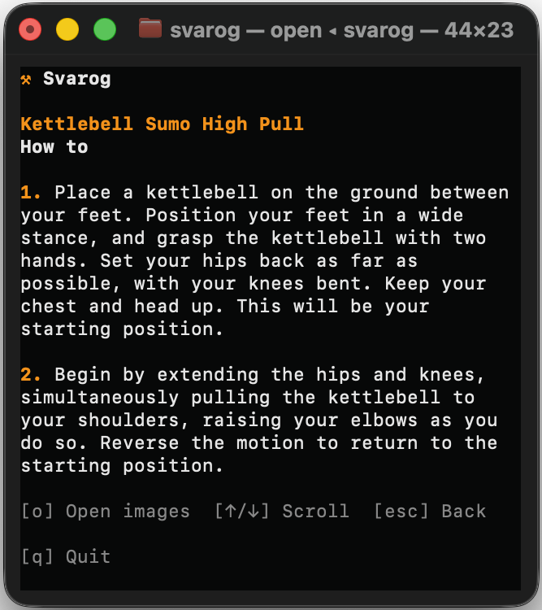

<p align="center">
  
</p>

<h1 align="center">Svarog</h1>

<p align="center">
  Turn AI-agent waiting time into short, adaptive exercise sessions.
</p>

<p align="center">
  <a href="https://github.com/zotttttttt/svarog/releases"></a>
  &nbsp;
  <a href="https://www.rust-lang.org/"></a>
  &nbsp;
  <a href="https://github.com/zotttttttt/svarog/actions/workflows/ci.yml?query=branch%3Amain"></a>
  &nbsp;
  <a href="https://github.com/zotttttttt/svarog/blob/main/LICENSE"></a>
  &nbsp;
  <a href="https://github.com/zotttttttt/svarog/releases/latest"></a>
</p>

Svarog supports macOS and Linux. Desktop notifications are currently available
on macOS only; the TUI, local collector, and recommenders work on both.

With Svarog, you can:

- get a small exercise whenever your coding agent gives you a natural pause;
- record completed reps, skips, fatigue, and pain;
- preview or regenerate your next movement sessions;
- use Codex, the OpenAI API, or the built-in local recommender;
- track today’s and the last seven days’ movement sessions, reps, and recommender token use.

## Get started

Install a stable Rust toolchain and `tmux` first. On macOS, the bootstrap script
can install missing prerequisites with rustup and Homebrew. On Linux, install
`tmux` with your distribution package manager and Rust from
[rustup.rs](https://rustup.rs/).

### Install a released binary

Download the archive for your computer from the
[latest GitHub release](../../releases/latest):

| Platform | Archive target |
| --- | --- |
| Apple Silicon macOS | `aarch64-apple-darwin` |
| Intel macOS | `x86_64-apple-darwin` |
| 64-bit Intel/AMD Linux | `x86_64-unknown-linux-gnu` |

Each archive contains `svarog`, this README, the Svarog license, third-party
notices, and the logo. Extract it and move `svarog` to a directory on your
`PATH`, for example:

```bash
archive="svarog-VERSION-TARGET"
tar -xzf "$archive.tar.gz"
mkdir -p "$HOME/.local/bin"
install -m 755 "$archive/svarog" "$HOME/.local/bin/svarog"
```

Replace `VERSION` and `TARGET` with the values in the downloaded filename.
Compare the archive with `SHA256SUMS` from the same release before installing.
Release binaries are not currently code-signed or notarized.

### Install from a checkout

From this checkout:

```bash
scripts/bootstrap
scripts/svarog
```

The first command checks for Rust and tmux. The second installs Svarog, walks
you through setup, installs the Codex integration, and opens the dashboard.
Press Enter during setup to accept the conservative defaults.

Afterward, start Svarog with:

```bash
svarog run
```

Bare `svarog` does the same thing. Keep one dashboard running while you work in
Codex. Prompts from all your Codex terminals feed that dashboard; prompt text is
not collected.

To erase your profile and all Svarog activity data and begin onboarding again,
stop any running dashboard and use:

```bash
svarog setup --reset
```

The command requires you to type `destroy all` before it changes anything. It
preserves the Svarog installation and Codex integration files.

The event collector listens only on a loopback address. Svarog rejects
non-loopback `SVAROG_DAEMON_ADDR` values because the local API is not
authenticated.

## Use Svarog

Keep `svarog run` open while you work. Svarog notices natural pauses from your
coding agent, prepares a safe short session, and leaves it ready until you
finish, skip, or report pain—even if the Codex turn that triggered it has
already ended. The waiting screen also shows your completed sessions and reps
for today and the last seven days.

<p align="center">
  <a href="./assets/1-tui-idle.png">
    
  </a>
</p>
<p align="center"><sub>The waiting dashboard keeps the next movement and recent progress within reach.</sub></p>

### While waiting

You can inspect or shape what happens next without waiting for another agent
pause:

| Key | Action |
| --- | --- |
| `f` | Start the first safe queued session now |
| `l` | Show up to 10 recent sessions, grouped by date |
| `n` | Preview upcoming sessions |
| `r` | Regenerate the queue from the upcoming-sessions view |
| `Esc` | Return from history or upcoming sessions to the waiting screen |
| `←` / `→` | Change the recommender |

The current recommender and, for remote recommenders, its input/output token
totals are shown on the waiting screen.

### During a movement session

Do the movement, adjust the recorded reps if needed, then record what happened:

<p align="center">
  <a href="./assets/2-tui-forging.png">
    
  </a>
  &nbsp;
  <a href="./assets/3-tui-how-to.png">
    
  </a>
</p>
<p align="center"><sub>Track the active session, then open step-by-step instructions without leaving the dashboard.</sub></p>

| Key | Action |
| --- | --- |
| `d` or Enter | Finish the movement session |
| `+` (`=`) / `-` | Adjust the reps you completed |
| `i` or `?` | Show instructions and reference images |
| `s` | Open the skip options |
| `p` | Report pain and block that movement |
| `q` | Quit Svarog |
| `Esc` | Cancel the current prompt or return to waiting |

From the skip options:

| Key | Action |
| --- | --- |
| `y` | Skip because you are fatigued; Svarog suppresses the next five opportunities |
| `n` | Skip without reporting fatigue |
| Backspace | Skip and remove this exercise from future recommendations |
| `Esc` | Cancel and return to the movement session |

In the instructions view, use `↑` / `↓`, Page Up / Page Down, Home, and End to
read longer instructions. Press `o` to download and open reference images when
they are available, then `Esc` to return to the movement session.

<p align="center">
  <a href="./assets/4-local-html-how-to.png">
    
  </a>
</p>
<p align="center"><sub>Reference images open in a local visual guide when they are available.</sub></p>

Use `svarog exercises removed`, `svarog exercises restore <exercise-id>`, or
`svarog exercises restore-all` to review or undo removals. Completing onboarding again resets
the removed list.

## Work beside your coding agent

You can run Codex and Svarog in separate terminals, or open both in a tmux
session:

```bash
svarog session codex
```

Click a pane to focus it, or press `Ctrl-b` and then an arrow key. Drag the pane
border to resize it. Svarog does not replace your tmux key bindings.

To stop every running Svarog dashboard and every Svarog-created tmux session:

```bash
svarog stop
```

Stopping a Svarog-created tmux session also closes the coding agent inside it.

## Choose recommendations

Svarog starts with its built-in Local recommender. Switch recommenders with the
arrow keys while Svarog is waiting.

| Recommender | What you get |
| --- | --- |
| Local | Uses Svarog’s conservative built-in rules without an LLM |
| OpenAI API | Uses your API key and keeps usage separate from Codex |
| Codex | Uses your installed Codex CLI; no separate API key |

To use the OpenAI API:

```bash
export OPENAI_API_KEY="..."
svarog run
```

Then select **OpenAI API** with `←` or `→`. To make the key available every
time, add the export to your shell profile.

Svarog generates recommendations in batches of ten, validates them against your
profile, and safely fills missing positions locally. When one queued session
remains, Svarog prepares another batch of ten and keeps the current session
available.

The waiting screen shows input/output token totals for the currently selected
remote recommender. Codex and OpenAI API usage are stored separately. Local does
not show a token panel.

## Notifications and safety

Svarog can notify you when a new movement session becomes actionable. Setup asks whether
you want desktop notifications; you can change the setting later in:

```text
~/.config/svarog/config.toml
```

Svarog starts with short sets and low daily limits. It avoids repeating the
same primary muscle, adds an 18-minute cooldown after a completed forge, blocks
a movement immediately after pain, and suppresses the next five opportunities
when you report fatigue.

Svarog is designed for one-person exercise sessions. Exercises that require a
partner for positioning, resistance, or assistance are excluded from every
recommender.

Recommendations are not medical advice. Stop if a movement hurts or feels
unsafe for you.

## Useful commands

| Command | Use it to |
| --- | --- |
| `svarog` / `svarog run` | Set up if needed, then open the dashboard |
| `svarog session codex` | Open Svarog and Codex together in tmux |
| `svarog status` | Inspect the current Svarog state |
| `svarog stop` | Stop Svarog runtimes and Svarog-created tmux sessions |
| `svarog setup` | Repair setup or answer newly added questions |
| `svarog demo` | Open an isolated project-local demo |
| `svarog --help` | Show all commands |

## Your data

Production data lives here:

- configuration: `~/.config/svarog/config.toml`
- workout history: `~/.local/share/svarog/svarog.sqlite3`
- Codex hook: `~/.codex/hooks.json`

Running setup again preserves your answers and workout history. If a release
adds a setup question, Svarog asks only the new question.

Svarog stores profile details such as age, height, weight, exercise goals,
equipment, cautious body parts, and injuries. Its config and database are
created with user-only permissions on macOS and Linux.

Recommendation data flow depends on the backend:

| Backend | Data leaves your machine? |
| --- | --- |
| Local | No |
| Codex | The exercise profile or bounded workout context is passed to your installed Codex CLI |
| OpenAI API | The exercise profile or bounded workout context is sent to the OpenAI Responses API |

Coding prompt text is neither stored nor included in recommendation requests.
The recommendation context can include exercise goals, equipment, injuries,
recent set outcomes, daily totals, and cooldown state. The OpenAI API key is
read from the configured environment variable and is not written to Svarog's
config or database.

## Try changes without touching your data

Use the project-local demo:

```bash
svarog demo
```

Demo data lives under `./.svarog-dev`; your production profile, history, and
hooks are untouched. On the next launch, press Enter to keep the demo data or
type `remove` to remove it and start over.

Other safe setup checks:

```bash
svarog setup --dry-run
svarog setup --dev
svarog setup --dev --dry-run
```

To connect Codex explicitly to the development sandbox:

```bash
SVAROG_HOME="$PWD/.svarog-dev/svarog" \
CODEX_HOME="$PWD/.svarog-dev/codex" \
SVAROG_DAEMON_ADDR="127.0.0.1:18787" \
SVAROG_MODE=dev \
codex
```

## Customize recommendations

Edit these MiniJinja templates to change how Svarog asks for exercises:

- `prompts/exercise_profile.j2`
- `prompts/recommendation_queue.j2`

For personal overrides that survive updates, copy matching files to:

```text
~/.config/svarog/prompts/
```

Svarog reloads overrides for every recommendation, so you do not need to
rebuild or restart it. The queue template receives `context` and `needed`; the
profile template receives `config`. Structured values support
`|tojson(indent=2)`.

## Exercise data

| Source | Used for | Terms |
| --- | --- | --- |
| [free-exercise-db](https://github.com/yuhonas/free-exercise-db) | Exercise catalog, instructions, and reference-image paths | [Unlicense](https://github.com/yuhonas/free-exercise-db/blob/main/LICENSE.md) |
| [Pinned revision `b0eed061`](https://github.com/yuhonas/free-exercise-db/commit/b0eed061e1c832b3ed815fbaa4b45b3cdc14df49) | Reproducible recommendations | Bundled as a compact local copy |

Reference images download on demand and are cached locally. Instructions and
image paths stay local; remote recommenders receive only `id`, `force`,
`mechanic`, `equipment`, `primaryMuscles`, `secondaryMuscles`, and `category`.

## Built with

| Library | Role |
| --- | --- |
| [Ratatui](https://ratatui.rs/) and [Crossterm](https://github.com/crossterm-rs/crossterm) | Terminal interface |
| [Tokio](https://tokio.rs/), [Axum](https://github.com/tokio-rs/axum), and [Reqwest](https://github.com/seanmonstar/reqwest) | Local collector and networking |
| [Rusqlite](https://github.com/rusqlite/rusqlite) and SQLite | Local workout history |
| [Clap](https://github.com/clap-rs/clap) | Command-line interface |
| [Serde](https://serde.rs/), [TOML](https://github.com/toml-rs/toml), and [MiniJinja](https://github.com/mitsuhiko/minijinja) | Configuration and recommendation templates |

See [third-party notices](THIRD_PARTY_NOTICES.html) for the complete dependency
and license inventory.

## Update a development install

Run `scripts/svarog` after changing this checkout. It detects source changes,
offers to reinstall the binary, and then continues with the command you passed:

```bash
scripts/svarog run
```

Control that prompt with `SVAROG_UPDATE=always`, `ask`, or `never`. You can also
install directly:

```bash
cargo install --locked --path . --force
```

## Contribute

See [CONTRIBUTING.md](CONTRIBUTING.md) for the development workflow and required
checks. Svarog is licensed under the [MIT License](LICENSE).
