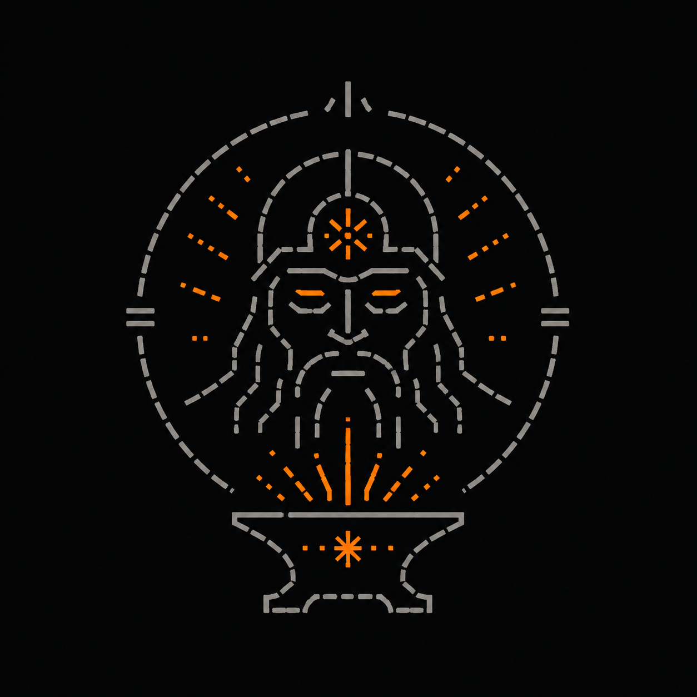
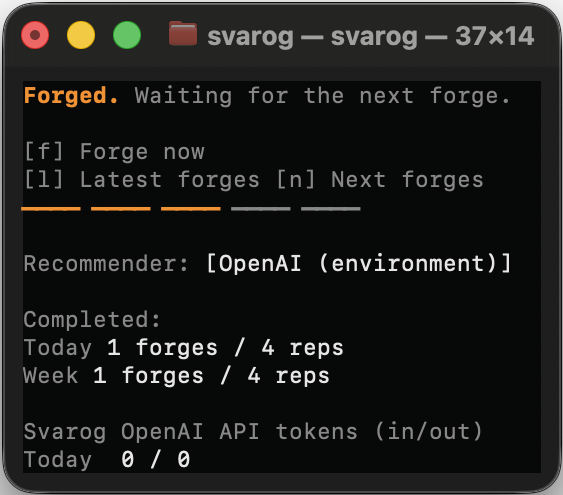
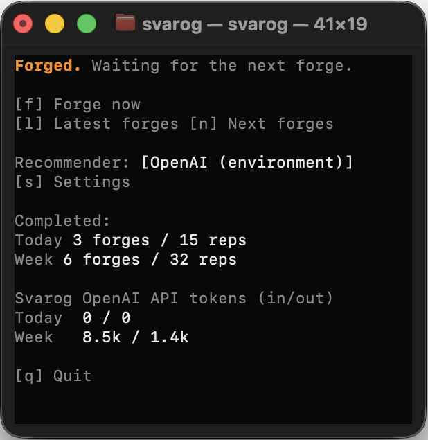
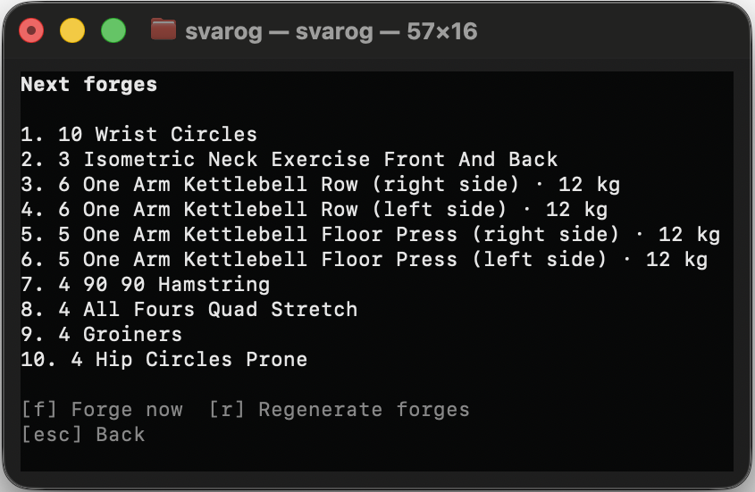
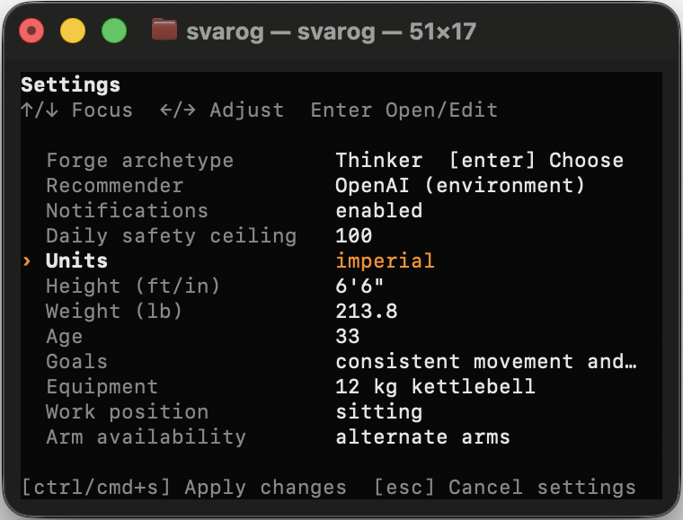
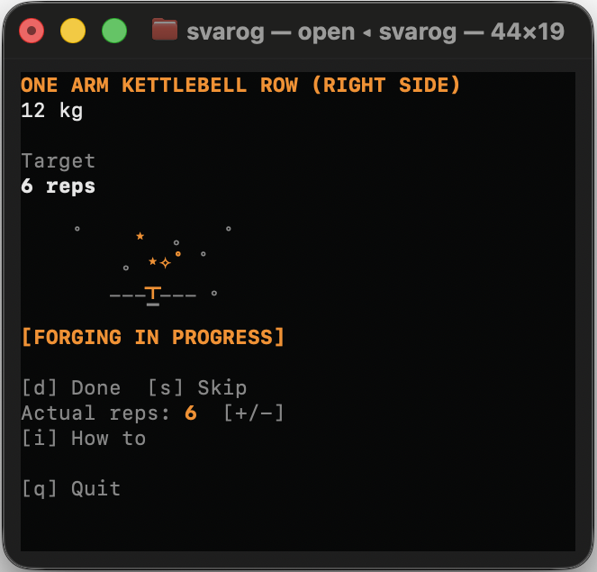
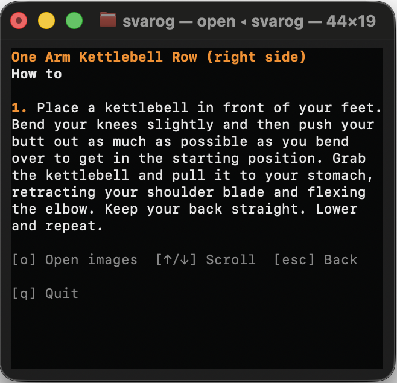
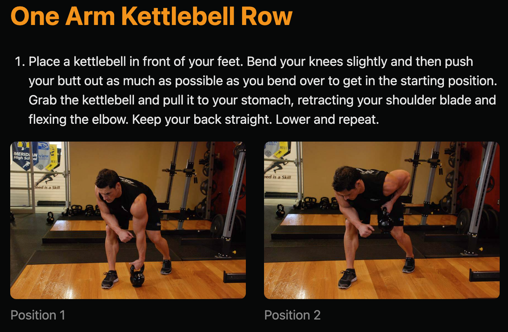
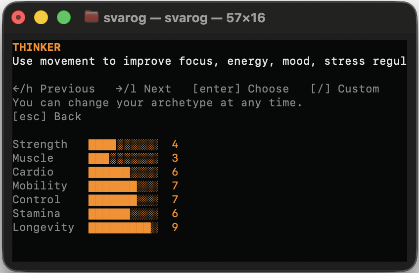

<p align="center">
  
</p>

<h1 align="center">Svarog</h1>

<p align="center">
  Turn AI-agent waiting time into short, adaptive exercise sessions.
</p>

<p align="center">
  <a href="https://github.com/zotttttttt/svarog/releases"></a>
  &nbsp;
  <a href="https://www.rust-lang.org/"></a>
  &nbsp;
  <a href="https://github.com/zotttttttt/svarog/actions/workflows/ci.yml?query=branch%3Amain"></a>
  &nbsp;
  <a href="https://github.com/zotttttttt/svarog/blob/main/LICENSE"></a>
  &nbsp;
  <a href="https://github.com/zotttttttt/svarog/releases/latest"></a>
  &nbsp;
  
  &nbsp;
  
</p>

Svarog is a local Rust CLI and terminal dashboard that turns the time your
coding agent spends executing a task into tiny workouts. It learns from your
equipment, preferences, recent activity, fatigue, and pain—then keeps each
movement short enough to finish while the agent works.

Choose a Forge archetype to give recommendations a long-term direction, while
your actual completions, changed reps, skips, and pain determine today's pace.

The loop is simple:

1. You give your coding agent a spec or prompt to execute.
2. As the agent starts working, Svarog prepares a safe, short movement.
3. You finish, skip, or report pain while the agent works.
4. Your history shapes what comes next.

Choose how Svarog generates recommendations:

| Recommender | Setup |
| --- | --- |
| Local | Conservative built-in rules; offline and enabled by default |
| Codex | Uses your installed Codex CLI; no separate API key needed |
| OpenAI (environment) | Reads `OPENAI_API_KEY` from the shell that starts Svarog |
| OpenAI (saved key) | Stores a key entered in Settings in macOS Keychain or Linux Secret Service |

For the environment option, export the key before starting Svarog:

```bash
export OPENAI_API_KEY="..."
svarog
```

For the saved-key option, open Settings, focus **Saved OpenAI key**, press
Enter, and enter the key. It is saved immediately in the operating system
credential store and remains available across Svarog restarts. When that
recommender is active, Svarog authorizes once and keeps the key in a zeroized
in-memory cache until you successfully apply another recommender or exit. Then
select the matching recommender and apply the Settings changes. Neither option
writes the key to Svarog's config or workout database. Prompt text is never
collected or sent in recommendation requests. See
[Recommenders](docs/recommenders.md) for configuration and fallback details.

## Get started

You need macOS or Linux. A Rust toolchain is only required when installing from
source. `tmux` is optional and only needed for `svarog session codex`.

### Install a release

Download the archive for your computer from the
[latest release](https://github.com/zotttttttt/svarog/releases/latest):

| Platform | Target |
| --- | --- |
| Apple Silicon macOS | `aarch64-apple-darwin` |
| Intel macOS | `x86_64-apple-darwin` |
| 64-bit Intel/AMD Linux | `x86_64-unknown-linux-gnu` |

Verify it against `SHA256SUMS`, extract it, and place `svarog` on your `PATH`:

```bash
archive="svarog-VERSION-TARGET"
tar -xzf "$archive.tar.gz"
mkdir -p "$HOME/.local/bin"
install -m 755 "$archive/svarog" "$HOME/.local/bin/svarog"
```

Release binaries are not currently code-signed or notarized.

### Install from a checkout

```bash
scripts/bootstrap
scripts/svarog
```

The bootstrap checks Rust; the launcher installs Svarog, guides you through
setup, connects Codex, and opens the dashboard. Press Enter to accept the
conservative defaults.

After setup, run Svarog in its own terminal:

```bash
svarog
```

Or open Svarog and Codex together in a tmux session:

```bash
svarog session codex
```

## Use Svarog

Keep one dashboard open while you work in any of your Codex terminals. A ready
movement stays available until you finish, skip, or report pain—even if the
agent turn that triggered it has ended.

<p align="center">
  <a href="./assets/1-idle-recommender-is-working.png">
    
  </a>
  &nbsp;
  <a href="./assets/2-idle.png">
    
  </a>
</p>
<p align="center"><sub>Svarog prepares the next movement while you work, then waits without interrupting your flow.</sub></p>

While waiting:

| Key | Action |
| --- | --- |
| `f` | Start the next safe movement now |
| `l` / `n` | View recent / upcoming movements |
| `r` | Regenerate from the upcoming-movements view |
| `s` | Open focus-driven Settings; use ↑/↓ to focus and ←/→ to change a field |

<p align="center">
  <a href="./assets/6-next-forges.png">
    
  </a>
  &nbsp;
  <a href="./assets/7-settings.png">
    
  </a>
</p>
<p align="center"><sub>Preview or regenerate upcoming movements, and update your profile, archetype, or recommender in Settings.</sub></p>

During a movement:

<p align="center">
  <a href="./assets/3-forging.png">
    
  </a>
  &nbsp;
  <a href="./assets/4-how-to.png">
    
  </a>
</p>
<p align="center"><sub>Record the result or open step-by-step instructions without leaving the dashboard.</sub></p>

| Key | Action |
| --- | --- |
| `d` or Enter | Finish and record the displayed reps |
| `+` / `-` | Adjust the reps you completed |
| `i` or `?` | Read step-by-step instructions |
| `o` | Open the visual guide with reference images from the instructions screen |
| `s` | Skip, report fatigue, or remove the exercise |
| `p` | Report pain and block the exercise |

<p align="center">
  <a href="./assets/5-how-to-images-in-browser.png">
    
  </a>
</p>
<p align="center"><sub>When available, reference images open on demand in a local visual guide.</sub></p>

> Svarog starts conservatively, respects reported pain and fatigue, and excludes
> exercises that require a partner. Recommendations are not medical advice;
> stop whenever a movement hurts or feels unsafe.

## Choose your Forge archetype

Your Forge archetype is the kind of physical capability you want Svarog to
gradually train you toward. It guides exercise selection over time, but never
assumes what you can handle today. You can change it at any time without losing
your history.

<p align="center">
  <a href="./assets/0-choose-your-fighter.png">
    
  </a>
</p>
<p align="center"><sub>Choose a long-term direction during setup, or change it later in Settings.</sub></p>

| Archetype | Long-term direction |
| --- | --- |
| Boxer | Fast, conditioned and durable: calisthenics, footwork, core work and very high distributed training volume. |
| Wrestler | Powerful and hard to fatigue: pulling, grip, posterior chain, carries, isometrics and explosive full-body strength. |
| Martial Artist | Lean, mobile and precise: speed, coordination, balance, core control and explosive movement. |
| Bodybuilder | Build muscle deliberately through resistance, progressive overload and hypertrophy-focused strength work. |
| Runner | Build a large aerobic engine through movement volume, cardiovascular fitness and durable lower-body endurance. |
| Athlete | Be good at everything: balanced strength, muscle, cardio, mobility, coordination and power. |
| Gymnast | Master your own body through relative strength, core control, balance, mobility and precise movement. |
| Yogi | Move freely and deliberately through mobility, flexibility, balance, breathing and controlled body awareness. |
| Mover | Strong posture and controlled movement through core work, mobility, balance and low-impact muscular endurance. |
| Thinker | Use movement to improve focus, energy, mood, stress regulation, sleep and cognitive performance. |
| Lifer | Stay strong, mobile, aerobically fit and physically independent for as many decades as possible. |

If none fits, choose **Custom** and name your own physical north star. Custom
archetypes keep the balanced Athlete behavior while giving the recommender your
chosen direction.

## Learn more

| Guide | What it covers |
| --- | --- |
| [Recommenders](docs/recommenders.md) | Local, Codex, OpenAI, API-key setup, queues, and fallback |
| [Commands](docs/commands.md) | Setup, daily use, exercise controls, demo, and reset |
| [Data and privacy](docs/data-and-privacy.md) | Stored data, file locations, network boundaries, and deletion |
| [Customization](docs/customization.md) | Profile settings, config, models, and prompt overrides |

## Exercise data

Svarog uses a compact local copy of
[free-exercise-db](https://github.com/yuhonas/free-exercise-db) at
[revision `b0eed061`](https://github.com/yuhonas/free-exercise-db/commit/b0eed061e1c832b3ed815fbaa4b45b3cdc14df49),
published under the [Unlicense](https://github.com/yuhonas/free-exercise-db/blob/main/LICENSE.md).
Partner-required exercises are removed from the canonical pool. Instructions
stay local; reference images download only when you ask for them and are then
cached locally.

Remote recommenders receive compact exercise metadata—not instructions or
images—and Svarog validates every result against the local catalog.

## Built with

[Rust](https://www.rust-lang.org/) · [Ratatui](https://ratatui.rs/) ·
[Crossterm](https://github.com/crossterm-rs/crossterm) ·
[Tokio](https://tokio.rs/) · [Axum](https://github.com/tokio-rs/axum) ·
[SQLite](https://sqlite.org/) · [Rusqlite](https://github.com/rusqlite/rusqlite) ·
[MiniJinja](https://github.com/mitsuhiko/minijinja)

See the [third-party notices](THIRD_PARTY_NOTICES.html) for the complete
dependency and license inventory.

## License and contribute

Svarog is available under the [MIT License](LICENSE). Contributions are
welcome—see [CONTRIBUTING.md](CONTRIBUTING.md) for the development workflow and
required checks.
