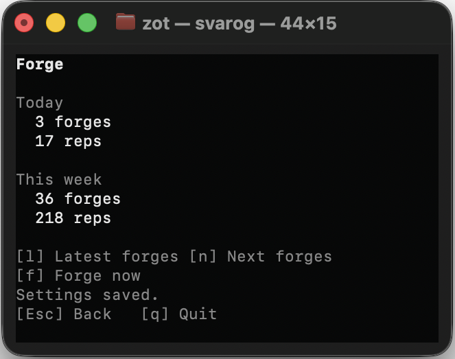
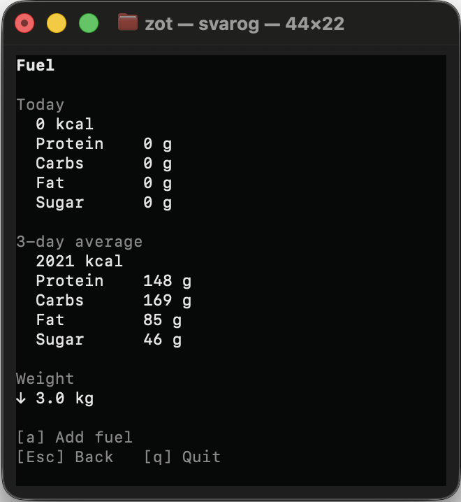
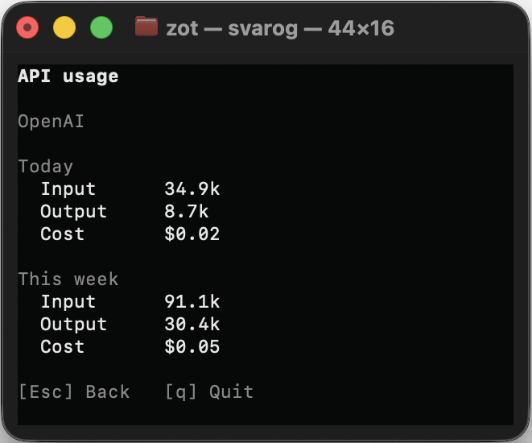

<p align="center">
  
</p>

<h1 align="center">Svarog</h1>

<p align="center">
  Turn AI-agent waiting time into short, adaptive exercise sessions.
</p>

<p align="center">
  <a href="https://github.com/zotttttttt/svarog/releases"></a>
  &nbsp;
  <a href="https://www.rust-lang.org/"></a>
  &nbsp;
  <a href="https://github.com/zotttttttt/svarog/actions/workflows/ci.yml?query=branch%3Amain"></a>
  &nbsp;
  <a href="https://github.com/zotttttttt/svarog/releases/latest"></a>
  &nbsp;
  
  &nbsp;
  <a href="https://github.com/zotttttttt/svarog/blob/main/LICENSE"></a>
</p>

Svarog is a local terminal dashboard that notices when Codex starts working and
turns that wait into a tiny workout.

Svarog adapts each forge to what you complete. It balances sides and recovery,
adjusts reps to your performance, and backs off after fatigue, skips, or pain.

Svarog can’t feel what you feel, so always stop if something doesn’t feel right.

<p align="center">
  <a href="./assets/2-idle.png">
    
  </a>
</p>

## Get started

Install the latest release on macOS or x86-64 Linux. Rust and `sudo` are not
required.

```bash
curl --proto '=https' --tlsv1.2 -LsSf \
  -o /tmp/svarog-installer.sh \
  https://github.com/zotttttttt/svarog/releases/latest/download/svarog-installer.sh
bash /tmp/svarog-installer.sh
$HOME/.local/bin/svarog
```

The installer selects the binary for your computer, verifies its embedded
SHA-256 checksum, and installs it to `~/.local/bin`. If that directory is not on
your `PATH`, it prints the exact line to add for future runs.

On first run, press Enter to accept the conservative defaults. Setup connects
Svarog to Codex lifecycle hooks and opens the dashboard. Keep it open while you
work in any Codex terminal. Codex may ask once to trust the hook.

Prefer to open both tools together? With `tmux` installed, run:

```bash
svarog session codex
```

For provenance verification, Cargo, manual downloads, upgrades, and source
builds, see [Installation](docs/installation.md).

## How it works

1. You submit a task to Codex.
2. Codex hooks tell the local Svarog dashboard that work has started.
3. Svarog prepares a safe movement short enough to finish during the wait.
4. Your completions, changed reps, skips, fatigue, and pain shape what comes
   next.

A ready movement remains available until you finish, skip, or report pain—even
if the Codex turn that triggered it has already ended. Coding prompt text is
never collected or sent in recommendation requests.

## Forge while Codex works

Start the suggested movement with `f`, record it with Enter, or adjust the reps
with `+` and `-`. Use `i` for instructions, `s` to skip or report fatigue, and
`p` to report pain and block the exercise.

<p align="center">
  <a href="./assets/3-forging.png">
    
  </a>
  &nbsp;
  <a href="./assets/4-how-to.png">
    
  </a>
</p>
<p align="center"><sub>Complete a movement or open step-by-step instructions without leaving the dashboard.</sub></p>

When an exercise has reference images, press `o` from its instructions to open
a local visual guide in your browser.

<p align="center">
  <a href="./assets/5-how-to-images-in-browser.png">
    
  </a>
</p>

> Svarog starts conservatively, respects reported pain and fatigue, and excludes
> exercises that require a partner. Stop any movement that hurts. Svarog is not
> medical advice.

## Make it yours

Choose a Forge archetype—such as Boxer, Yogi, Thinker, or Lifer—to give your
training a long-term direction. Your actual performance and safety feedback
still determine today's pace. You can change the archetype, profile, equipment,
and preferences at any time without losing history.

<p align="center">
  <a href="./assets/0-choose-your-fighter.png">
    
  </a>
  &nbsp;
  <a href="./assets/7-settings.png">
    
  </a>
</p>
<p align="center"><sub>Pick a physical north star during setup, then refine your profile from Settings.</sub></p>

Svarog works fully offline with its conservative Local recommender. You can
optionally use your installed Codex CLI or an OpenAI API key to generate future
movements. Every result is validated locally against your equipment, safety
profile, cooldowns, and exercise catalog. See [Recommenders](docs/recommenders.md)
for setup and fallback behavior.

## See your progress

Open Forge, Fuel, or API from the dashboard to review recent workouts, nutrition
and water, or recommender usage. Press `a` to log food or adjust today's water;
meal parsing requires the Codex or OpenAI recommender, while water stays local.

<p align="center">
  <a href="./assets/8-stats-forges.png">
    
  </a>
  &nbsp;
  <a href="./assets/9-stats-fuel.png">
    
  </a>
  &nbsp;
  <a href="./assets/10-stats-api.png">
    
  </a>
</p>
<p align="center"><sub>Workouts, fuel, hydration, weight trend, and recommender usage stay easy to inspect.</sub></p>

## Everyday controls

| Key | Action |
| --- | --- |
| `↑` / `↓`, Enter, Esc | Navigate dashboard views |
| `f` | Start the next movement now |
| `a` | Add fuel or update water |
| `s` | Open Settings, including app updates; skip or report fatigue during a movement |
| `i` / `?` | Read movement instructions |
| `d` / Enter | Finish and record the displayed reps |
| `p` | Report pain and block the current exercise |

See [Commands](docs/commands.md) for all dashboard controls, CLI commands,
reset behavior, and isolated demo mode.

## Documentation

| Guide | What it covers |
| --- | --- |
| [Installation](docs/installation.md) | Verified installs, Cargo, upgrades, source builds, and platform notes |
| [Commands](docs/commands.md) | Dashboard controls, CLI commands, demo mode, and reset |
| [Customization](docs/customization.md) | Forge archetypes, profile settings, config, and prompt overrides |
| [Recommenders](docs/recommenders.md) | Local, Codex, OpenAI, API keys, queues, and fallback |
| [Fuel and water](docs/fuel-and-water.md) | Meal logging, nutrition estimates, dates, and hydration |
| [Data and privacy](docs/data-and-privacy.md) | Stored data, network boundaries, credentials, and deletion |

## Project

Svarog uses a compact local copy of
[free-exercise-db](https://github.com/yuhonas/free-exercise-db) at
[revision `b0eed061`](https://github.com/yuhonas/free-exercise-db/commit/b0eed061e1c832b3ed815fbaa4b45b3cdc14df49),
published under the [Unlicense](https://github.com/yuhonas/free-exercise-db/blob/main/LICENSE.md).
Instructions stay local; reference images download only when requested and are
then cached locally.

Svarog is built with Rust and Ratatui and released under the [MIT License](LICENSE).
Contributions are welcome—see [CONTRIBUTING.md](CONTRIBUTING.md). The complete
dependency and license inventory is in [THIRD_PARTY_NOTICES.html](THIRD_PARTY_NOTICES.html).
